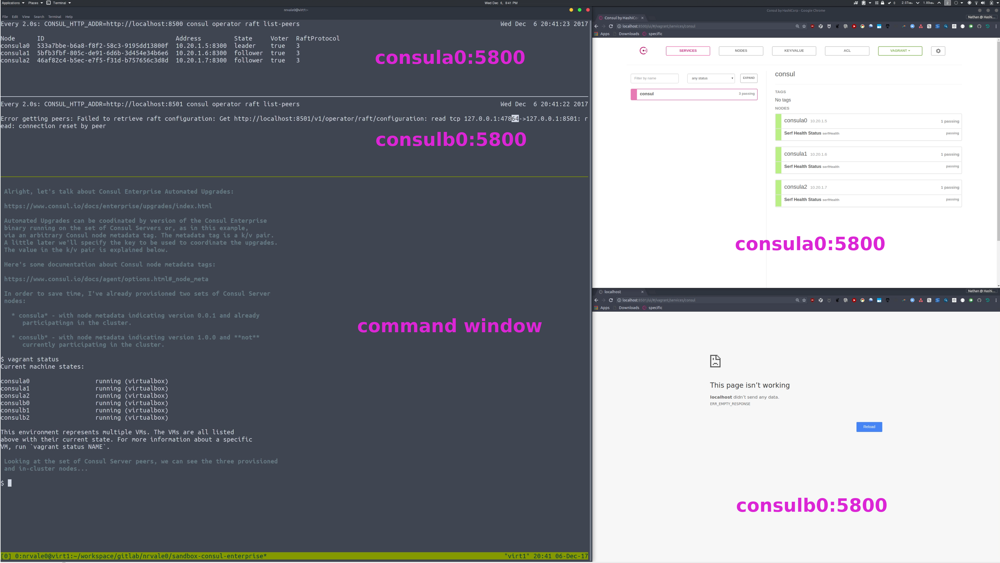
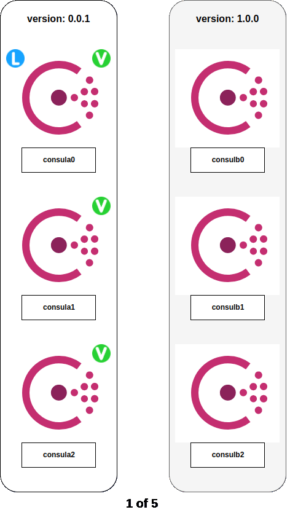
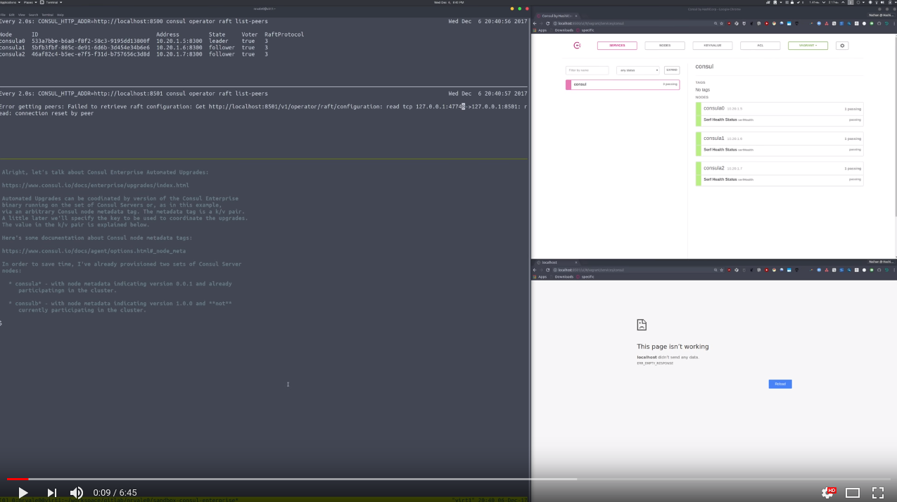

# Consul Enterprise Automated Upgrades Guide

This repo demonstrates the [Automated Upgrade](https://www.consul.io/docs/enterprise/upgrades/index.html) feature of [HashiCorp](https://hashicorp.com)'s [Consul Enterprise](https://consul.io).

Consul is a remarkably reliable technology however making sure that Leader status and Quorum are maintained across upgrades and auto-scale events can be tricky. In other to make that process as easy as possible, Consul Enterprise provides functionality to make automate upgrades by keying off of one of two bits of information:

1. the Consul version of the Servers in the cluster
1. a SemVer-formatted k/v pair in the [node metadata](https://www.consul.io/docs/agent/options.html#_node_meta) of the Consul Servers

Scenario #1 is simple enough to understand. Scenario #2 is useful because it allows Consul Operators to SemVer the version of **their deployment** of the Consul service. The 2nd method is demonstrated in the ppre-recorded demo below.

* cluster "a" nodes have specified node metadata "cluster_version=0.0.1"
* cluster "b" nodes have specified node metadata "cluster_version=1.0.0"

## Pre-recorded demo

Below you will find a video which shows the progress of an automated upgrade run. There's a fair amount going on in the demo so lets first look at an annotated screen capture of the demo before watching the video.

### Overview of the demo windows


* top-left - a 'watch' of the Consul cluster status on node consula0
* middle-left - a 'watch' of the Consul cluster status on node consulb0
* bottom-left - the command window where all comments and commands will be shown
* top-right - an auto-reloading browser window connected to the Consul UI on consula0
* botton-right - an auto-reloading browser window connected to the Consul UI on consulb0

Because we will be the Consul cluster from cluster "a" to cluster "b" over the course of the demo, the 'watch' windows and browser windows will show either show cluster status messages or connection errors depending on where we are in the upgrade process. That is by intent.

### Visual representation of the upgrade process

The following graphic captures the progression of both Consul Voter("V") status and Consul Leader("L") status in the pre-recorded demo. It might be helpful to memorize this progression before proceeding to the pre-recorded demo.



### Video demo

Alright, let's do this! Here's the pre-recorded demo of the Consul Enterprise Automated Upgrade process using SemVer-based node metadata tags (as opposed to Consul version). There's a lot going on here so don't forget **you can pause and adjust playback speed of the video**! **Also, 1080p or higher is highly recommended.**

[](https://www.youtube.com/watch?v=wxzcLQC1VpI)

## Challenge - Reproducing the demo video

Instructions for reproducing the above pre-recorded demo, either to update the Guide or for self-guides learning about Consul Enterprise Automated Upgrades, are found below.


### Reference Materials
* [Consul Enterprise Automated Upgrades](https://www.consul.io/docs/enterprise/upgrades/index.html)

### Requirements

System hardware:
* the more CPUs/cores the better as the demo environment is composed of 6 running VMs
* approx 3+ GB of RAM - whatever is required for your host OS plus 6 x 512MB for the 6 VMs

Software:
* [Oracle Virtualbox](https://virtualbox.org)
* [HashiCorp Vagrant](https://hashicorp.com)
* [Python 3 runtime](https://python.org)
* [Consul binary](https://consul.io) for interacting with the Consul cluster
* [the unix 'watch' command](https://en.wikipedia.org/wiki/Watch_(Unix)) - this is probably already installed but just in case...

Note that although the demo environment demonstrates Consul Enterprise-only features, one can still interact with the Consul cluster, at least for the purposes of this demo, with the Open Source binary.

### Setup

The demo environemnt uses multi-VM vagrant to bring up two sets of 3 VMs which will participate in the Consul cluster. The sets of nodes are differentiated by using "a" and "b" desginations. For instance:

* consula0 == consul in cluster "a" and the zeroeth node
* consulb1 == consul in cluster "b" and the 1st node

Vagrant [port-forwards] the following ports from the private network of the multi-VM enviroment to the localhost as such:

| address | TCP port | VM | TCP port |
| --- | --- | --- | --- |fLyMd-mAkEr
| localhost | 8500 | consula0 | 8500 |
| localhost | 8501 | consulb1 | 8500 |

Although the VMs run in a private network managed by Virtualbox and Vagrant, these port-mappings allow you limited interaction with the Consul cluster from your workstation using the localhost-mapped ports.

#### Setting up your workstation

Much of the tooling used to interact with the Consul cluster is from the Python ecosystem. The resposity comes with a bundle requirements.txt file which should make it easy to install this tooling:

```pre
$ pip install -r requirements.txt
```
Note, if your Python environment has not been configured to live in your home directory you may have to:

1. prefix the above command with 'sudo' to install in system directories
1. or, preferably, this is probabaly a good time to get familar with the [anyenv](https://github.com/riywo/anyenv) and [pyenv](https://github.com/pyenv/pyenv) tools

The environment also relies on a handful of Vagrant plugins. Assuming you've already installed Vagrant, you can install the plugins like so:

```pre
$ vagrant plugin install vagrant-hosts
$ vagrant plugin install vagrant-auto_network
```

#### Operating the demo environment

Vagrant/Virtualbox can take a few minutes to spin the VMs (serial operation :\) plus there's a minimal amount of work to be done installing supporting packages so it makes sense to get that out of the way first.

```pre
$ vagrant up /consul/
```

Next, let's provision the Consul cluster composed of the "a" nodes.

```pre
$ vagrant up /consula/ --provision-with configure,validate
```

You should see green [Chef Inspec](https://www.chef.io/inspec/) output for each VM indicating that pre-flight checks have executed with success. If you see red or orange checks that means something is amiss. The best recourse is to run the the similar command shown below. The environment has been designed to be as idempotent as possible despite not using an idempotent configuration management tool. If the problems persist then feel free reach out using the contact information included with this doc.

It might also be useful to note that you can re-rerun *just the validation* tests at any time like so:

```pre
$ for i in consula0 consula1 consula2; do vagrant provision $i --provision-with configure,validate; done
```

It might be useful to note that you can re-run just the validation tests for any provisioned and running node at any time. The example below is for just 'consula0':

```pre
$ vagrant provision consula0 --provision-with validate
```

Assuming that all of the nodes a running and that the "a" nodes are already configured as a Consul cluster, you should now be able to see the Consul cluster UI on ```http://localhost:8500```.

To start the upgrade:

```pre
$ doitlive play vms/consul/consul-upgrade.sh
```

[doitlive](https://doitlive.readthedocs.io/en/latest/) is a tool for scripting command-line demos. Once doitlive has been invoked you can type random keys and it will send the scripted input to stdin of your shell. Ctrl-C will break out of the scripted demo.

Note that the ```vms/consul/consul-upgrade.sh``` script resets the cluster by removing the directory ```/var/hashicorp/consul``` and restarting the Consul processes. 

That's it. Learn. Play. Send bug reports and questions. Enjoy.

## Contact

* Nathan Valentine - nathan @ hashicorp com | nrvale00 @ gmail com
* https://github.com/hashicorp-guides
* https://hashicorp.com
* https://github.com/nrvale0
