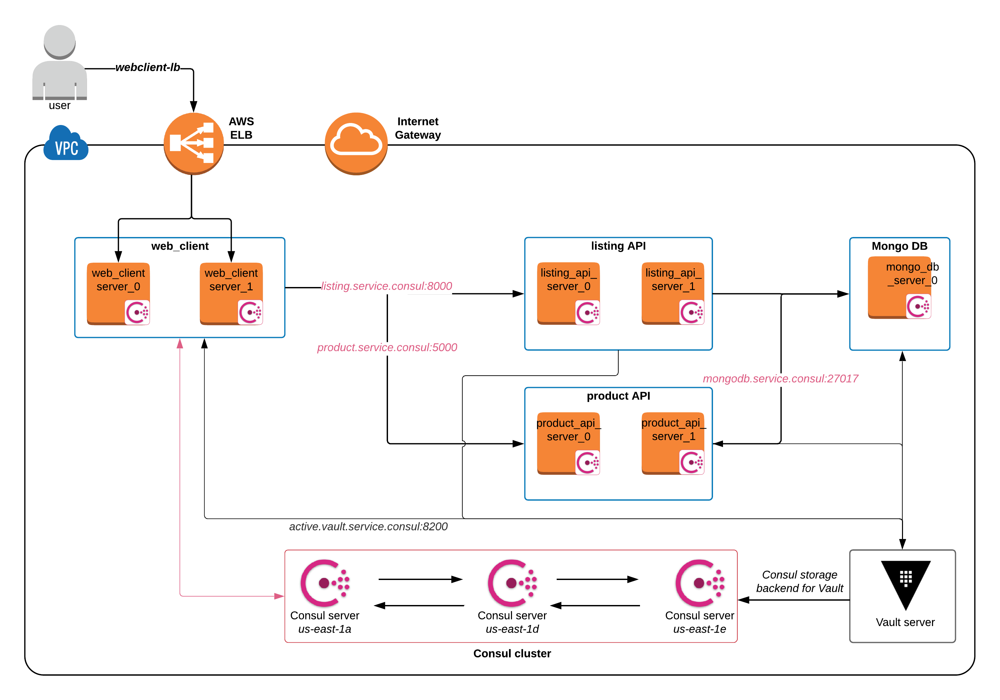

# Service Configuration Using Consul Template, envconsul, and Vault

This repo demonstrates how to leverage tools such as  [Consul Template](https://github.com/hashicorp/consul-template/blob/master/README.md) and [envconsul](https://github.com/hashicorp/envconsul/blob/master/README.md) for service configuration. These tools read application configuration from Consul and secrets from Vault and manage the application lifecycle.

**Time to complete**: 20 minutes

Below is an architecture overview; the reader may **[skip ahead to Running the demo](terraform/aws/README.md)**

## Architecture overview:
This repo uses Terraform to deploy the items below.
1. **Infrastructure components**:
  1. A Consul cluster (v1.4.0) and a set of client nodes will be deployed. Consul is installed by packer using configuration file [consul_base.json](packer/consul_base.json).

  - A Vault server (v1.0.1) will be deployed to provide dynamic credentials for Mongo DB. Vault is installed using [install_vault.sh](packer/files/install_vault.sh).

  - A Mongo DB server (v3.6) with a Database called `bbthe90s`, and 2 Collections: `Products` and `Listing` will  be deployed to provide example data. MongoDB is installed using [install_mongodb.sh](packer/files/install_mongodb.sh).

- **Application components**:
  1. A Python [Web Client](application/simple-client) that interacts with the end user. It queries Product and Listing API, then displays the contents on a web page.

  - A Python [Product API](application/product-service/README.md)
    - Application configuration is stored in Consul and read from `config.yml`. [Consul Template](https://github.com/hashicorp/consul-template/blob/master/README.md) (v0.19.5) renders `config.yml`. Consul Template is installed using [install_client_tools.sh](packer/files/install_client_tools.sh).
    - Mongo DB credentials are obtained from Vault using [hvac Vault Python SDK](https://github.com/hvac/hvac), [EC2 auth method](https://www.vaultproject.io/docs/auth/aws.html#ec2-auth-method) and [AWS secrets engine](https://www.vaultproject.io/docs/secrets/aws/index.html#aws-secrets-engine).

  - A Node.js [Listing API](application/listing-service/README.md)
    - Application configuration is stored in Consul and read as environment variables. [Envconsul](https://github.com/hashicorp/envconsul) (v0.7.3) renders these environment variables. Envconsul is installed using  [install_client_tools.sh](packer/files/install_client_tools.sh).
    - Envconsul also reads Mongo DB credentials from Vault using Vault's [EC2 auth method](https://www.vaultproject.io/docs/auth/aws.html#ec2-auth-method) and [MongoDB Database Secrets Engine](https://www.vaultproject.io/docs/secrets/databases/mongodb.html#mongodb-database-secrets-engine) in this process.

## Provisioning and Running the demo in AWS:
Please follow steps in [Running the Demo](terraform/aws/README.md)

## Architecture Diagram:

